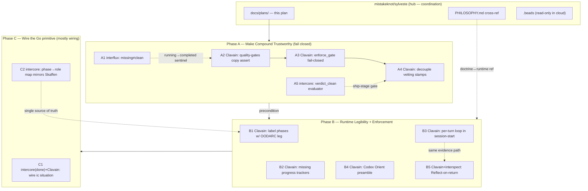

# Strengthen & Enforce OODARC Across the Sylveste Polyrepo (Claude Code + Codex)

> **This is a cross-repo coordination plan, not a single-PR change.** It lives in the
> `mistakeknot/sylveste` hub because the work spans six sibling repositories. Each work
> item must be executed in a session scoped to its owning repo. Line numbers cited inside
> sibling repos are draft anchors — *re-verify in-repo before editing.*

## Context

**OODARC** (Observe · Orient · Decide · Act · Reflect · Compound) is Sylveste's central operating paradigm, canonically defined in `PHILOSOPHY.md:30-45` (it enumerates all six legs at nested per-turn / per-sprint / cross-session timescales). It extends Boyd's OODA with **Reflect** (extract the lesson) and **Compound** (persist it so future behavior changes), because LLM agents don't carry intuition across sessions — learning must be *structural*.

The problem: OODARC is **strong doctrine but thin runtime**. It is barely *named* in the surface agents read each session, and the **Compound** half is undermined by a documented fail-open chain (gates fail *open*, so `tests_passed`/`vetted` stamp regardless of findings, and "no output file" reads as "clean"). A loop that silently passes can't compound — it journals success that didn't happen.

### Repository map

This repo (`mistakeknot/sylveste`) is the **coordination hub** — docs, `sylveste-*` beads, `.clavain/` artifacts; **no source for the components below**. Each component is its own repository:

| Concern | Repository | Language |
|---|---|---|
| Sprint/work commands, hooks, dispatch | `mistakeknot/Clavain` | Shell |
| Flux synthesis skill + spec | `mistakeknot/interflux` | Python/MD |
| Phase FSM, gates, `ic` CLI, observation | `mistakeknot/intercore` | Go |
| Canonical OODARC Go phases | `mistakeknot/Skaffen` | Go |
| Codex dispatch profile | `mistakeknot/interserve` | Go |
| Evidence store | `mistakeknot/interspect` | Shell |
| `PHILOSOPHY.md`, `docs/**`, `.beads/` | `mistakeknot/sylveste` (hub) | — |

**Intended outcome:** OODARC becomes legible and *enforced* in the runtime both hosts read — gates fail closed so Compound is trustworthy, sprint phases carry explicit OODARC labels, the per-turn loop is named for the interactive agent, `ic situation` is wired in as the shared Observe surface, and the Codex/interserve path reaches parity. No new parallel evidence silo (per `sylveste-104h`: "consume Clavain's proven schema — add columns, don't fork").

**Sequencing:** Phase A (fix gates) → Phase B (runtime legibility + enforcement) → Phase C (Go primitive, scoped down since `ic situation` already exists). Claude Code and Codex weighted **equally** — every OODARC contract added for one host gets the other's equivalent.

---

## Execution topology

Phases are independently shippable and verifiable. **A is the hard precondition** — Compound can't be trusted until gates fail closed. Within A: A1→A2→A3→A4 is a dependency chain (each closes the next link of the fail-open path); A5 is parallel Go work that feeds the ship-stage guard A4 relies on.

---

## Phase A — Close the Fail-Open Chain (Compound becomes trustworthy)

*Beads: `sylveste-n35t` (P0, open), `sylveste-scx1` (P1, open), `sylveste-0ly7` (P1, open), `sylveste-qf1k` (P1, open). The roadmap's current "Now" priority.*

**Principle:** every gate emits a **positive completion sentinel** (an artifact proving it ran and what it concluded); absence-of-failure is never read as success.

### A1 — interflux: "missing file" ≠ "clean" (`sylveste-n35t` layer 1)
- **Repo/Where:** `mistakeknot/interflux` — `skills/flux-engine/phases/synthesize.md` and `docs/spec/core/synthesis.md` *(verify in-repo; draft cited synthesize.md:25-41 and synthesis.md:20-25)*. The state table maps **Missing → "no findings."**
- **Change:** Split "Missing" into two states. An agent that *started* but produced no output file = **error/inconclusive** (gate-blocking), distinct from an agent that ran and returned a clean verdict. Require a `.started` sentinel **or** consume intercore's dispatch-lifecycle `running→completed` event so synthesis distinguishes "crashed" from "clean." Prefer the intercore event if the dispatch already emits it (avoids a new sentinel file).

### A2 — Clavain: stop swallowing copy failures (`sylveste-n35t` layer 2)
- **Repo/Where:** `mistakeknot/Clavain` — `commands/quality-gates.md` *(verify in-repo; draft cited :102-103)*: `cp "$FLUX_OUTPUT_DIR/synthesis.md" … || true` (and `.json`).
- **Change:** After the copies, assert both files exist and are non-empty; `return 1` (block) otherwise. `|| true` makes a missing synthesis indistinguishable from a clean one.

### A3 — Clavain: `enforce_gate` fails closed, not open (`sylveste-scx1`, `sylveste-n35t` layer 3)
- **Repo/Where:** `mistakeknot/Clavain` — `hooks/lib-sprint.sh`. The library header declares the whole file "fail-safe (return 0 on error, never block)" — the architectural root of the chain. `enforce_gate` returns `0` when it can't resolve a run id or find a spec.
- **Change:** Invert **only the gate-enforcement path** (telemetry helpers stay fail-safe). Add a `CLAVAIN_GATE_FAILMODE` distinction: gate checks default to **fail-closed** (no run id / no spec / ic unavailable → `return 1` + actionable stderr), with an explicit, logged `CLAVAIN_SKIP_GATE="reason"` escape hatch that records *why*. This is `sylveste-scx1`'s "degraded-modes as an active breaker."

### A4 — Clavain: decouple vetting stamps from gate outcome (`sylveste-qf1k`)
- **Repo/Where:** `mistakeknot/Clavain` — `commands/sprint.md` Steps 6 & 7 *(verify in-repo; draft cited :336-340, :381-385)* and the mirror in `commands/work.md` *(draft cited :119-123)*. The `bd set-state … vetted_at/vetted_sha/tests_passed=true` block runs unconditionally.
- **Change:** Guard the stamp on the *actual* `enforce_gate` exit status; on failure stamp `gate_failed=true` instead. These stamps feed the auto-proceed authz gate at ship time (`docs/canon/policy-merge.md` in this hub — `tests_passed` boolean AND-merges and cannot be silently weakened). A false stamp = unreviewed code ships.

### A5 — intercore: implement the `verdict_clean` ship-gate evaluator (`sylveste-0ly7`)
- **Repo/Where:** Declared in YAML in `mistakeknot/Clavain` (`commands/degraded-modes.yaml`) but has **no Go evaluator** — decorative. Evaluator lives in `mistakeknot/intercore` (`internal/phase/gate.go` → `evaluateGate`, dispatched from `cmd/ic/gate.go` → `cmdGateCheck`) *(verify in-repo)*.
- **Change:** Add a `verdict_clean` evaluator in `gate.go` that reads the quality-verdict / degraded-subsystem state and fails the `executing→shipping` transition when any critical subsystem (review-fleet, test-suite) is degraded or the verdict isn't clean. Set the ship stage to `enforce`. Emit structured evidence listing the blocking subsystems. Add `gate_test.go` coverage (degraded subsystem → block).

**Phase A verification (per-repo):**
- Clavain + interflux: construct a sprint where flux-drive produces no synthesis (kill the agent) → quality-gates must `return 1`, `tests_passed` must NOT be stamped, ship gate must block.
- intercore: `go test ./internal/phase/...`; add `verdict_clean` test; confirm existing `TestIsValidRejectsOODARC` still passes.

---

## Phase B — Runtime Legibility + Enforcement (Claude Code + Codex equally)

*Pure host-surface (no Go kernel changes). Almost entirely in `mistakeknot/Clavain` (B5 also writes to `mistakeknot/interspect`). Relates to `sylveste-lta9` (sprint-lifecycle OODARC alignment; the sprint-v2 brainstorm in this hub carries the D1/D3 mappings B1 derives from).*

### B1 — Clavain: label sprint/work phases with their OODARC leg
- Apply the mapping from this hub's `docs/brainstorms/2026-03-19-sprint-v2-lifecycle-redesign-brainstorm.md` (Brainstorm→Observe, Strategy→Orient, Write-Plan→Decide, Plan-Review→Validate-gate, Execute→Act, Quality-Gates→Observe(quality), Resolve→Act(corrective), Reflect→**Reflect+Compound**, Ship→Terminal).
- **Where:** `mistakeknot/Clavain` progress checklists in `commands/sprint.md` and the phase commands. Annotate each step, e.g. `Step 2: Strategy (Orient)`. Mirrors the existing reference in `commands/brainstorm.md` which already names "Reflect + Compound."

### B2 — Clavain: add the missing progress trackers (legibility floor)
- 5/9 phase commands have a `## Progress Tracking` checklist; `write-plan`, `plan-review`, and `work`/`execute-plan` do not. Add them, each carrying its OODARC leg label. `work.md` uses inline phases — give it a real checklist.

### B3 — Clavain: name the per-turn OODARC loop for the interactive agent
- **Where:** `mistakeknot/Clavain` — `hooks/session-start.sh` (`additionalContext` assembly) and/or `skills/using-clavain/SKILL.md`.
- **Change:** Inject a terse per-turn contract: "Each turn: **Observe** (read tool results/state) → **Orient** (situate against goal + recent evidence) → **Decide** → **Act** → **Reflect** (did the outcome match expectation?). On significant outcomes (errors, recoveries, novel situations) pause and **Compound** before continuing." A standing reminder, not a phase machine. This is the single biggest legibility gap — per-turn OODARC is named nowhere in the surface the agent reads.

### B4 — Clavain: Codex parity — Orient briefing on dispatch
- **Where:** `mistakeknot/Clavain` — `scripts/dispatch.sh` (`--inject-docs` prompt assembly) and the template in `agents/workflow/codex-delegate.md`.
- **Change:** When dispatching (esp. `CLAVAIN_DISPATCH_PROFILE=interserve`), wrap injected docs with an explicit **Orient** preamble: "Read project conventions (CLAUDE.md/AGENTS.md above) and existing patterns for this task class before acting. You are executing the **Act** leg of an OODARC loop; report findings so the caller can **Reflect**." Today Codex gets a raw file list + verdict format with zero phase framing.

### B5 — Clavain + interspect: Codex parity — Reflect-on-return evidence
- **Where:** `mistakeknot/Clavain` — `scripts/dispatch.sh` post-execution (`_extract_verdict`) and the evidence insert in `agents/workflow/codex-delegate.md`. Evidence lands in `mistakeknot/interspect`.
- **Change:** After Codex returns, record a structured **Reflect** receipt to the *existing* interspect evidence path (do NOT mint a new store — `sylveste-104h`). Add an `oodarc_phase` tag to the `delegation_outcome` context JSON so cross-session learning can attribute evidence by leg. Closes the Codex loop the way the interactive agent's Stop hook does.

**Phase B verification:** Run `/sprint` on a trivial bead → each step prints its OODARC leg; write-plan/plan-review/work show checklists. Start a session → per-turn contract appears in injected context (`session-start.sh` output / `claude --debug`). Dispatch a Codex task via interserve → prompt contains the Orient preamble and a Reflect receipt with `oodarc_phase` lands in `.clavain/interspect/interspect.db`.

---

## Phase C — Wire the Go Primitive (scoped down: `ic situation` already exists)

*Approach A Step 1 foundation is already built (see this hub's `docs/plans/2026-02-28-oodarc-shared-observation-layer.md` — the `observation` package + `ic situation snapshot` command shipped). This phase is mostly **wiring**. Defer the generic `OODARCLoop[S,O,D,A,R]` interface (Approach B). Relates to `sylveste-benl.3` (port OODARC prompt builder to Go, P1 open).*

### C1 — Wire `ic situation snapshot` into the host Observe surface
- It exists in `mistakeknot/intercore` (`cmd/ic/situation.go`, `internal/observation/observation.go` with `Snapshot/RunSummary/DispatchSummary/QueueSummary/BudgetSummary`) but is invoked only by `cmd/clavain-cli/sprint.go` — never by a hook/command/skill agents read. Textbook "wired or it doesn't exist" gap.
- **Change (in `mistakeknot/Clavain`):** Make `ic situation snapshot` the canonical **Observe** call at sprint/phase boundaries — replace the ad-hoc multi-query orientation in `hooks/session-start.sh` / `hooks/lib-sprint.sh` where it duplicates this — and document it in the using-clavain skill as *the* one-shot orientation command. Observation becomes O(1).

### C2 — intercore: add a `phase → OODARC-role` mapping mirroring Skaffen
- Skaffen is canonical: `mistakeknot/Skaffen` `internal/tool/tool.go` defines `PhaseObserve/Orient/Decide/Act/Reflect/Compound` plus lifecycle aliases *(verify in-repo; draft cited :33-45)*. `mistakeknot/intercore` `pkg/phase/phase.go` already separates the two concepts in comments and has `TestIsValidRejectsOODARC`.
- **Change (in `mistakeknot/intercore`):** Add `pkg/phase/roles.go` with a `PhaseToOODARCRole` map (brainstorm→observe, strategized→orient, planned→decide, executing→act, review→observe, polish→act, reflect→reflect+compound, done→terminal). Keep FSM constants untouched — an *annotation*, not a state change. Phase B's labels then derive from one source of truth shared with Skaffen, preventing drift.

**Phase C verification:** `ic situation snapshot --run=<id>` returns the aggregated snapshot; confirm a Clavain sprint hook now calls it instead of N separate `ic` queries. Add a `pkg/phase` test asserting every `DefaultChain` phase has a role and roles match Skaffen's aliases. `go test ./...` in intercore.

---

## Cross-Cutting

- **One evidence path only.** All Compound/Reflect receipts flow into the existing interspect schema (add columns, don't fork). Hard constraint per `sylveste-104h`.
- **Doc cross-refs.** `PHILOSOPHY.md:30-45` already defines OODARC canonically; a forward pointer to this coordination plan lands in the hub. Update `mistakeknot/Clavain`'s `docs/clavain-roadmap.md` (its repo) to point at the wired surface once B lands.
- **Beads.** `.beads/issues.jsonl` lives here but is **read-only in cloud sessions** (per CLAUDE.md). Note any new/changed bead intent (e.g., children under `sylveste-owjn`) in the PR description; let the workstation file them with `bd`. Beads named above are verified open.

## What lands in the hub vs. carried out

- **Hub (`mistakeknot/sylveste`) lands:** this plan doc, the `PHILOSOPHY.md` forward-pointer, and PR-described bead candidates.
- **Carried to per-repo sessions:** Phase A1–A5, all of Phase B, all of Phase C, and the Clavain roadmap edit. Open each in a session scoped to the owning repo, re-verify the cited paths/line numbers there, then implement against the per-phase verification above.

## Suggested execution order

A1→A5 (gates fail closed) → B1→B3 (Claude Code legibility) → B4→B5 (Codex parity) → C1→C2 (wire the existing primitive + shared role map). A is the hard precondition.
